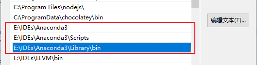
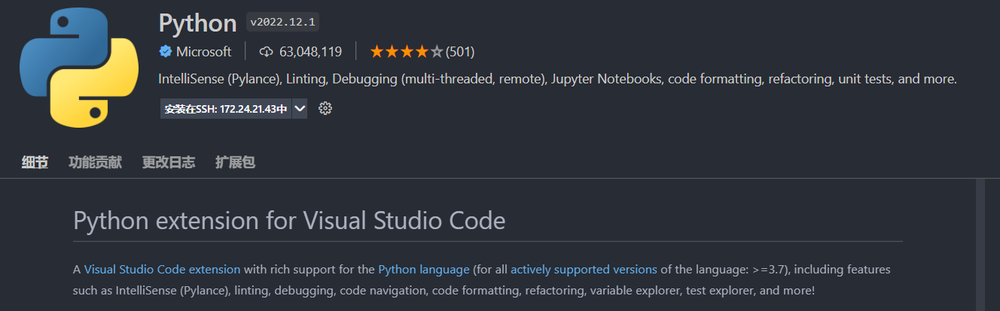

# 1. 搭建与配置 Python 开发环境

Table of Contents

- [1. 搭建与配置 Python 开发环境](#1-搭建与配置-python-开发环境)
  - [1.1. 概述](#11-概述)
  - [1.2. 安装与配置 Python 解释器](#12-安装与配置-python-解释器)
    - [1.2.1. Linux 安装与配置 Python 解释器](#121-linux-安装与配置-python-解释器)
    - [1.2.2. Windows 安装与配置 Python 解释器](#122-windows-安装与配置-python-解释器)
  - [1.3. 安装 VSCode 插件](#13-安装-vscode-插件)
    - [1.3.1. 安装 Python 语法插件](#131-安装-python-语法插件)

## 1.1. 概述

通过 *VSCode* 进行开发 Python 需要两个东西：

1. *Python* 解释器
2. *VSCode* 的 *Python* 语法插件以及代码检查插件

## 1.2. 安装与配置 Python 解释器

### 1.2.1. Linux 安装与配置 Python 解释器

> 参阅：[linux_搭建用户专用的Python环境](https://github.com/Aphroidte/it_learn/blob/main/doc/languaue/python/config/linux_%E5%88%9B%E5%BB%BApython%E8%99%9A%E6%8B%9F%E7%8E%AF%E5%A2%83.md)

### 1.2.2. Windows 安装与配置 Python 解释器

> 注：以下方法是通过直接安装 *Anaconda* 集成环境，来安装 *Python* 解释器。你也可以在 *Python* 官网下载 *Python* 解释器进行安装：<https://www.python.org/downloads/>

在 [*Anaconda* 官网](https://www.anaconda.com/) 下载 *Anaconda*:

下载完成后，按提示点击安装即可。安装完成后，在 *CMD* 中使用命令: `python --version` 检查是否安装成功。

> 注：安装成功后，`python --version` 命令会输出当前支持的 *Python* 版本。

配置 *Anaconda* 路径到环境变量中：主要是配置 *Anaconda* 以下三个路径：

> 注：上图中的路径仅为本人环境的路径，具体的路径需要视您的 *Anaconda* 安装路径而定。配置完成后，在 *CMD* (Ctrl + Shift + C) 中执行 `conda version` 命令，若能正常输出版本信息，即配置成功。

## 1.3. 安装 VSCode 插件

### 1.3.1. 安装 Python 语法插件

在 *VSCode* 的 marketplace 中搜索以下插件进行安装并按照提示进行设置即可

> 插件介绍：[VScode Python插件介绍](https://marketplace.visualstudio.com/items?itemName=ms-python.python)
>
> 译文：[VSCode Python](../extensions/python.md)
