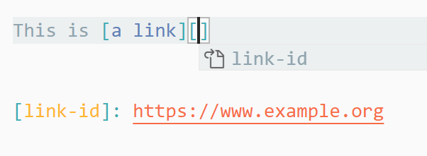
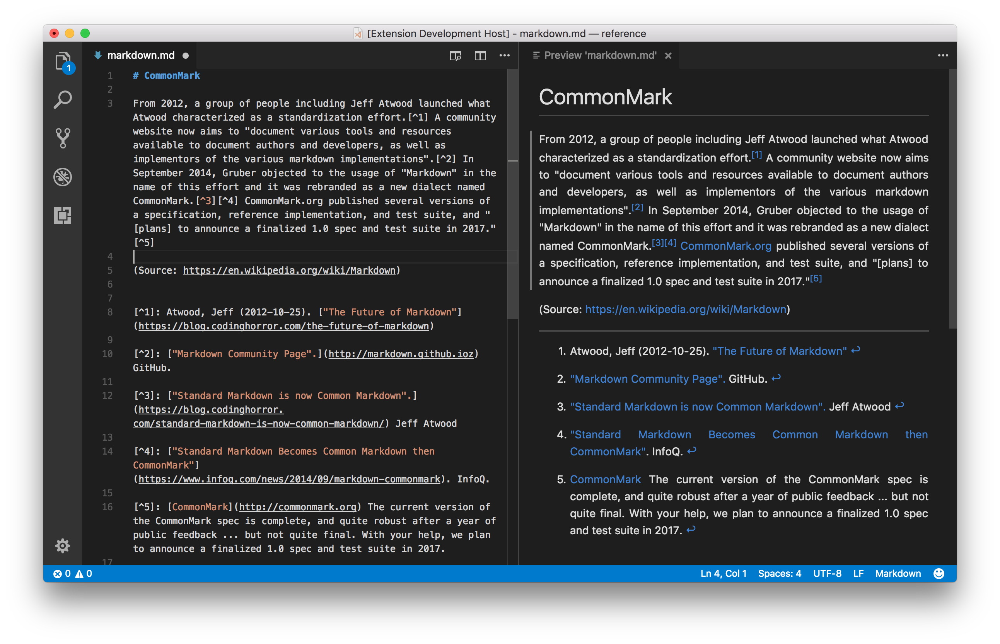

# 1. Markdown All in One

- [1. Markdown All in One](#1-markdown-all-in-one)
  - [1.1. 官方文档](#11-官方文档)
    - [1.1.1. 基本功能](#111-基本功能)
      - [1.1.1.1. 键盘快捷键](#1111-键盘快捷键)
      - [1.1.1.2. 目录（Table of contents）](#1112-目录table-of-contents)
      - [1.1.1.3. 列表编辑](#1113-列表编辑)
      - [1.1.1.4. 将 Markdown 转换成 HTML](#1114-将-markdown-转换成-html)
      - [1.1.1.5. GitHub 风格的 Markdown](#1115-github-风格的-markdown)
      - [1.1.1.6. Math](#1116-math)
      - [1.1.1.7. Auto completions](#1117-auto-completions)
      - [1.1.1.8. 其他](#1118-其他)
    - [1.1.2. 可用的命令](#112-可用的命令)
    - [1.1.3. 支持的设置](#113-支持的设置)
    - [1.1.4. FAQ](#114-faq)
  - [1.2. 其他简单Markdown插件的用法](#12-其他简单markdown插件的用法)
    - [Markdown Footnotes](#markdown-footnotes)

## 1.1. 官方文档

> 详见 Markdown All in One [official documentation](https://marketplace.visualstudio.com/items?itemName=yzhang.markdown-all-in-one)

该插件包含了 Markdown 所需的一切（键盘快捷键、目录、自动预览等）。

> 注：VSCode 本身已经支持了 Markdown 的一些基本功能（e.g 预览），详见 [official documentation](https://code.visualstudio.com/docs/languages/markdown)

### 1.1.1. 基本功能

#### 1.1.1.1. 键盘快捷键

| Key                    | Command                 |
| :--------------------- | :---------------------- |
| `Ctrl/Cmd + B`         | 切换粗体                |
| `Ctrl/Cmd + I`         | 切换斜体                |
| `Alt+S` (on Windows)   | 切换删除线              |
| `Ctrl + Shift + ]`     | 切换标题（上级）        |
| `Ctrl + Shift + [`     | 切换标题（下层）        |
| `Ctrl/Cmd + M`         | 切换数学环境            |
| `Alt + C`              | 选中/取消选中任务列表项 |
| `Ctrl/Cmd + Shift + V` | 切换预览                |
| `Ctrl/Cmd + K V`       | 在侧边栏切换预览        |

> 注：如果光标在没有选择的列表/任务项上，删除线将添加到整个项目（行）

自己定义的快捷键：

| Key              | Command                   |
| :--------------- | :------------------------ |
| `Ctrl + Alt + T` | 创建目录                  |
| `Ctrl + Alt + S` | 添加/更新 Section numbers |
| `Ctrl + Alt + B` | 添加行内代码标记          |
| `Ctrl + Alt + X` | 添加代码块标记            |

#### 1.1.1.2. 目录（Table of contents）

- 运行命令 ``Create Table of Contents``（在 VS Code 命令面板中，通过 `Ctrl + Shift + P` 打开），以插入新的目录。建议将其设置成快捷键 `Ctrl + Alt + T`。
- 默认情况下，目录会在文件保存时自动更新。要禁用，请更改 toc.updateOnSave 选项。在VSCode 的 Setting.json 中增加配置：`markdown.extension.toc.updateOnSave`
- 要使 TOC 与 GitHub 或 GitLab 兼容，请相应地设置选项 slugifyMode。在VSCode 的 Setting.json 中增加配置：`markdown.extension.toc.slugifyMode`
- 控制目录中出现哪些标题的三种方法：
  1. 在标题末尾添加 `<!-- omit in toc -->` 以在 TOC 中忽略它 （也可以放在标题上方）
  2. 您还可以使用 toc.omittedFromToc 设置从 TOC 中省略一些标题（及其子标题）。配置方法将下方的代码。
  3. 使用 toc.levels 设置
- 轻松添加/更新/删除部分编号。在 VS Code 命令面板中运行命令：
  - `Add/Update section numbers`：添加或更新标题序号。建议将其设置成快捷键 `Ctrl + Alt + S`。
  - `Remove section numbers`：删除标题序号
- 如果您看到意外的 TOC 识别，您可以在列表上方添加 `<!-- no toc -->` 注释。

> 注：使用目录时，建议设置 `markdown.extension.list.indentationSize` 选项。

*toc.omittedFromToc* 的配置样例：

```json
// In your settings.json
"markdown.extension.toc.omittedFromToc": {
  // Use a path relative to your workspace.
  "README.md": [
      "# Introduction",
      "## Also omitted",
  ],
  // Or an absolute path for standalone files.
  "/home/foo/Documents/todo-list.md": [
    "## Shame list (I'll never do these)",
  ]
}
```

> 注1：Setext 标题（用 === 或 --- 下划线）也可以省略，只需将它们的 # 和 ## 版本分别放在设置中即可。
>
> 注2：省略标题时，请确保文档中的标题是唯一的。重复的标题可能会导致不可预知的行为。

#### 1.1.1.3. 列表编辑

在列表的一行中，直接键入 `Enter` 可直接在下一行添加列表标识。

> 注：默认情况下，此扩展尝试根据 [CommonMark Spec](https://spec.commonmark.org/0.29/#list-items) 规范确定不同列表的缩进大小。如果您更喜欢使用固定标签大小，请更改 `markdown.extension.list.indentationSize` 设置。

#### 1.1.1.4. 将 Markdown 转换成 HTML

- 命令 `Print current document to HTML`，会将 Markdown 转换成 HTML，然后输出。
- 与其他已安装的 Markdown 插件（例如 [Markdown Footnotes](https://marketplace.visualstudio.com/items?itemName=bierner.markdown-footnotes)）兼容。导出的 HTML 应该与 VS Code 中的外观相同（由于 API 的限制，一些主题颜色除外）。
- 使用注释 `<!-- title: Your Title -->` 指定导出 HTML 的标题
- .md 文件的普通链接将转换为 .html。
- 如果您想与他人共享文档，建议使用浏览器（例如 Chrome）将导出的 HTML 打印为 PDF。

#### 1.1.1.5. GitHub 风格的 Markdown

- 表格格式化程序：通过快捷键 `Alt + Shift + F` 可以将表格格式化。（在 Linux 上，键绑定是 `Ctrl + Shift + I`。请参阅 [Visual Studio Code 键绑定](https://code.visualstudio.com/docs/getstarted/keybindings#_keyboard-shortcuts-reference)。）
- Task lists

#### 1.1.1.6. Math

**请使用 [Markdown+Math](https://marketplace.visualstudio.com/items?itemName=goessner.mdmath) 获得专门的数学支持。请务必禁用此扩展的 `markdown.math.enabled` 选项。**

#### 1.1.1.7. Auto completions

支持在引用图像/文件、latex 公式时，进行语法/路径提示。

- 图像/文件是在 `search.exclude` 配置的路径中进行搜索的。默认会搜索本项目下的图片文件。
- 数学函数（在选项 `markdown.extension.katex.macros` 中进行配置）
- Reference links：如下图所示。



#### 1.1.1.8. 其他

- 在所选文本上粘贴链接
- 添加“关闭预览”键绑定，允许您使用与“打开预览”相同的键绑定（Ctrl + Shift + V 或 Ctrl + K V）关闭预览选项卡。

### 1.1.2. 可用的命令

- `Markdown All in One: Create Table of Contents`：创建目录
- `Markdown All in One: Update Table of Contents`：更新目录
- `Markdown All in One: Add/Update section numbers`：添加/更新标题序号
- `Markdown All in One: Remove section numbers`：移除标题序号
- `Markdown All in One: Toggle code span`：添加行内代码标记
- `Markdown All in One: Toggle code block`：添加代码块标记
- `Markdown All in One: Print current document to HTML`：输出为 HTML
- `Markdown All in One: Print documents to HTML`
- `Markdown All in One: Toggle math environment`
- `Markdown All in One: Toggle list`
  - 它将循环通过列表标记（-、*、+、1. 和 1））

### 1.1.3. 支持的设置

详见 [官方文档](https://marketplace.visualstudio.com/items?itemName=yzhang.markdown-all-in-one)。

### 1.1.4. FAQ

**Q: Which Markdown syntax is supported?**

- [CommonMark](https://spec.commonmark.org/)
- [表格](https://help.github.com/articles/organizing-information-with-tables/), [删除线](https://help.github.com/articles/basic-writing-and-formatting-syntax/#styling-text) and [task lists](https://docs.github.com/en/github/writing-on-github/basic-writing-and-formatting-syntax#task-lists) (from GitHub Flavored Markdown)
- [Math support](https://github.com/waylonflinn/markdown-it-katex#syntax) (from KaTeX)
- [Front matter](https://github.com/ParkSB/markdown-it-front-matter#valid-front-matter)

对于其他 Markdown 语法，您需要从 VS Code 市场安装相应的扩展（例如 [Mermaid diagram](https://marketplace.visualstudio.com/items?itemName=bierner.markdown-mermaid)、[表情符号](https://marketplace.visualstudio.com/items?itemName=bierner.markdown-emoji)、[脚注](https://marketplace.visualstudio.com/items?itemName=bierner.markdown-footnotes) 和 [上标](https://marketplace.visualstudio.com/items?itemName=DevHawk.markdown-sup)）。安装后，它们将在 VS Code 以及导出的 HTML 文件中生效。

**Q: 扩展程序无响应，导致延迟等（性能问题）**

根据经验，性能问题很有可能是由其他扩展（例如，一些拼写检查扩展）引起的。

如果您在禁用所有其他扩展程序（执行命令: `Reload with Extensions Disabled or Extensions: Disable All Installed Extensions for this Workspace`）的情况下，重新启用此扩展程序来验证这一点。

要找出根本原因，您可以安装我们的 [开发版本](https://marketplace.visualstudio.com/items?itemName=yzhang.markdown-all-in-one#latest-development-build) (debug.vsix) 并按照 VS Code 的 [官方说明](https://github.com/microsoft/vscode/wiki/Performance-Issues#profile-the-running-extensions) 创建 CPU 配置文件。然后请打开附有该配置文件 (.cpuprofile.txt) 的 GitHub 问题

## 1.2. 其他简单Markdown插件的用法

### Markdown Footnotes

添加脚注：

- 在需要的地方添加：`[^number]`，如：`[^1]`
- 在文本末尾或其他合适的地方定义：`[^number]:xxxxxxx`


