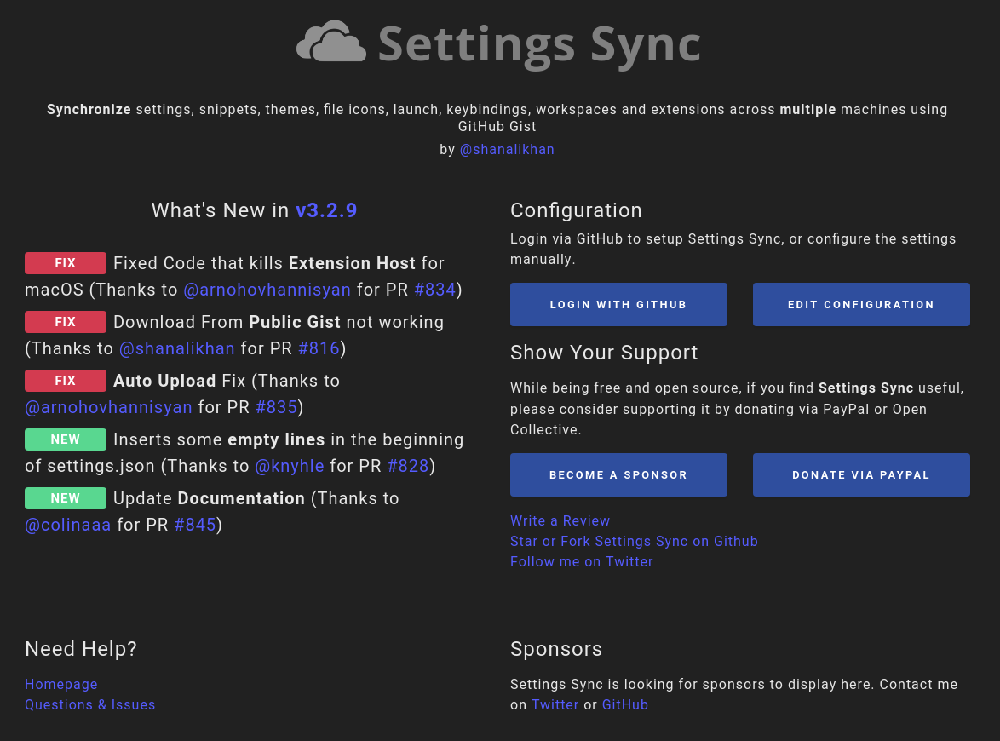
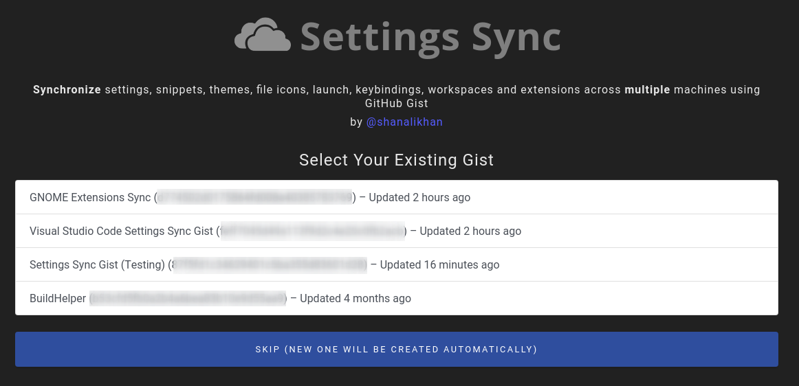
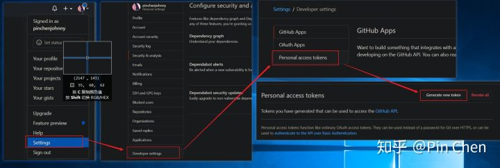
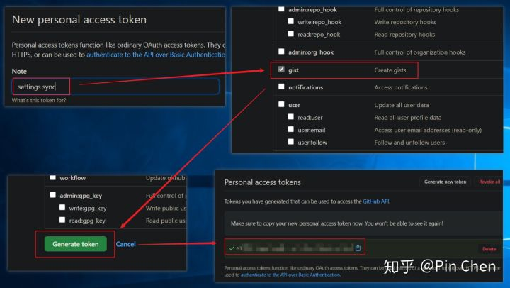
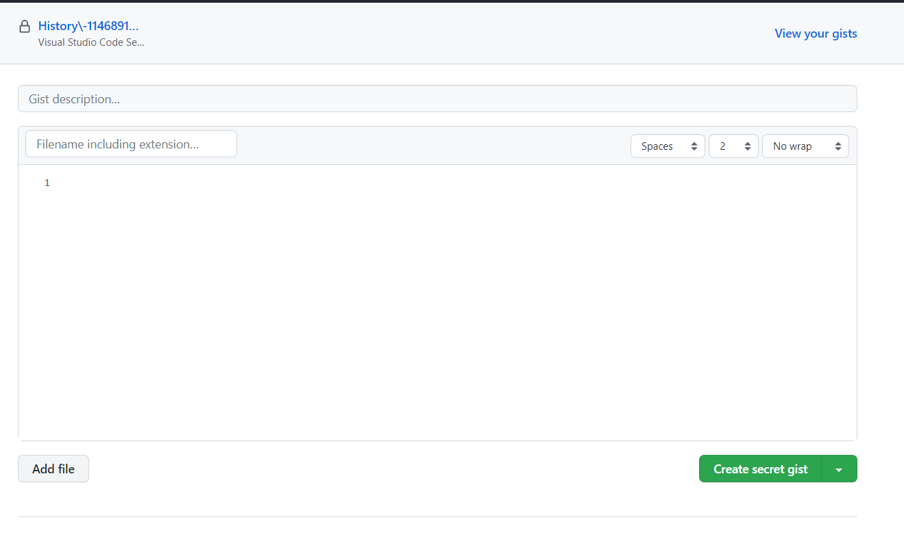
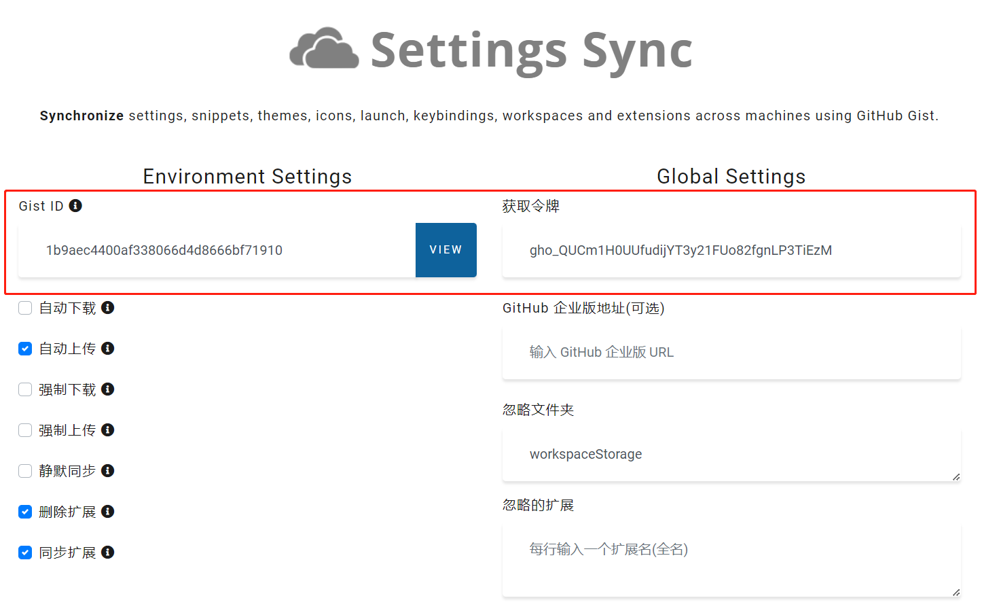

# 1. Settings Sync

> 曾用名：Visual Studio Code Settings Sync

- [1. Settings Sync](#1-settings-sync)
  - [1.1. 官方文档](#11-官方文档)
    - [1.1.1. 主要特征](#111-主要特征)
    - [1.1.2. It Syncs](#112-it-syncs)
    - [1.1.3. Shortcuts](#113-shortcuts)
    - [1.1.4. 配置设置同步](#114-配置设置同步)
    - [1.1.5. 上传您的设置](#115-上传您的设置)
    - [1.1.6. 下载您的设置](#116-下载您的设置)
    - [1.1.7. 重置扩展设置](#117-重置扩展设置)
    - [1.1.8. Settings](#118-settings)
      - [1.1.8.1. Gist Setting](#1181-gist-setting)
      - [1.1.8.2. Global Settings](#1182-global-settings)
    - [1.1.9. Features](#119-features)
      - [1.1.9.1. 更改时自动上传](#1191-更改时自动上传)
      - [1.1.9.2. 自动下载](#1192-自动下载)
      - [1.1.9.3. 强制下载](#1193-强制下载)
      - [1.1.9.4. 强制上传](#1194-强制上传)
      - [1.1.9.5. 摘要](#1195-摘要)
      - [1.1.9.6. 自定义同步](#1196-自定义同步)
      - [1.1.9.7. 在团队和用户之间共享设置](#1197-在团队和用户之间共享设置)
      - [1.1.9.8. 故障排除](#1198-故障排除)
  - [1.2. 新建Token以及创建新的Gist用于上传配置](#12-新建token以及创建新的gist用于上传配置)
    - [1.2.1. 创建 Token](#121-创建-token)
    - [1.2.2. 创建 Gist](#122-创建-gist)
    - [1.2.3. 配置 Setting Sync](#123-配置-setting-sync)

## 1.1. 官方文档

> 详见 Settings Sync [官方文档](https://marketplace.visualstudio.com/items?itemName=Shan.code-settings-sync)
>
> 注：在命令面板中键入 `Sync` 以查看所有命令。

### 1.1.1. 主要特征

- 使用您的 GitHub 帐户令牌和 Gist。
- 一键轻松上传和下载。
- 最后显示一个摘要页面，其中包含有关配置和扩展的详细信息。
- 启动时自动下载最新设置
- 文件更改时自动上传设置。
- 与其他用户分享 Gist 并让他们下载您的设置。
- 支持 GitHub 企业
- 支持带有 `@sync` 关键字的编译指示：支持 host、os 和 env。
- 用于更改设置/登录的 GUI
- 允许您在您的机器上同步任何文件

### 1.1.2. It Syncs

包含的所有扩展和完整的用户文件夹：

- Settings File
- 快捷键设置
- 启动文件
- Snippets Folder
- VSCode Extensions & Extensions Configurations
- Workspaces Folder

### 1.1.3. Shortcuts

1. 上传：`Shift + Alt + U`
2. 下载：`Shift + Alt + D`

> 注：(on macOS: `Shift + Option + U` / `Shift + Option + D`)

### 1.1.4. 配置设置同步

设置同步配置页面将在代码启动时自动打开，需要设置两件事：

1. GitHub 令牌
2. GitHub Gist ID

如果您是第一次使用，则需要由您的 GitHub 帐户检索 GitHub 令牌，而 Settings Sync 会创建 GIST。

以下是您需要执行的配置步骤：

<!-- markdownlint-disable MD036 -->
**单击使用 GitHub 登录**



- 在浏览器上登录 GitHub 并在收到成功消息后关闭浏览器选项卡。（如果您第一次使用 *Settings Sync*，则在您上传设置时会自动创建 *GIST*。）
- 如果您已经拥有 GitHub Gist，将打开新窗口以允许您选择 GitHub Gist 或跳过以创建新 Gist。



您始终可以通过访问 `<https://gist.github.com>` 并检查名为 `cloudSettings` 的 gist 来验证创建的 gist。

### 1.1.5. 上传您的设置

按 `Shift + Alt + U`（macOS：`Shift + Option + U`） 或在命令行中输入：`Sync`，找到 download/upload 的命令。

首次下载或上传时，会自动打开欢迎页面，您可以在其中配置设置同步。选择上传后，上传设置后。您将看到摘要详细信息以及上传的每个文件和扩展名的列表。

### 1.1.6. 下载您的设置

按 `Shift + Alt + D`（macOS：`Shift + Option + D`），或在命令行中输入：`Sync`，找到 download/upload 的命令。

首次下载或上传时，会自动打开欢迎页面，您可以在其中配置设置同步。一旦你选择下载，下载后。设置同步将向您显示摘要，其中包含正在下载的每个文件和扩展名的列表。下载完成后，将打开新的弹出窗口，允许您重新启动代码以应用设置。

### 1.1.7. 重置扩展设置

在命令面板中选择 `Sync : Reset Extension Settings` 以重置您的设置

### 1.1.8. Settings

可以通过设置页面更改设置，可以通过 `> Sync : Advanced Options > Open Settings Pag` 访问

设置同步中有两种类型的设置。我会建议您阅读 [此处](https://dev.to/shanalikhan/visual-studio-code-settings-sync-configurations-mn0) 的配置详细信息。

就其范围而言，设置同步有两种类型的配置：

- Gist Setting
- Global Settings

`Setting Sync Global Settings` 是适用于所有 *Visual Studio Code* 环境的设置，而 `Gist Settings` 的范围仅限于 *Visual Studio* 当前环境。

GitHub 令牌是全局设置的一部分，原因有两个，首先是它对用户的敏感信息，我们不允许上传 GitHub 令牌以及 Gist 中的代码设置。其次，它适用于所有 Gist，需要下载任何 Gist。

#### 1.1.8.1. Gist Setting

Gist 设置存储在带有同步前缀的 Visual Studio 代码 *settings.json* 中，并且可能因不同的 Gist（Visual Studio 环境）而异，并将被新下载的设置替换。您可以在 gist 设置中自定义设置，例如：

```json
{
    // 配置 Gist Id（环境）
    "sync.gist": "",
    // 为 GitHub Gist 配置自动上传/下载
    "sync.autoDownload": false,
    "sync.autoUpload": false,
    // 配置强制下载
    "sync.forceDownload": false,
    // 配置扩展同步行为
    "sync.removeExtensions": true,
    "sync.syncExtensions": true,
    // 配置强制上传
    "sync.forceUpload": false,
    // 配置安静同步
    "sync.quietSync": false
}
```

- *Gist*: Github Gist ID
- *autoDownload*: 默认为 `false`。如果您将其设置为 `true`，它将在代码启动时自动下载设置。
- *autoUpload*: 默认为 `false`。当 Visual Studio Loads 设置为 `true` 时，它​​将自动开始下载过程， `false` 将不允许扩展程序在启动时自动下载设置。
- *forceDownload*: 默认为 `false`。如果您将其设置为 `true`，它将在每次手动或启动下载过程时覆盖现有设置。
- *removeExtensions*: 默认为 `true`。当 syncExtensions 为 `true` 并下载扩展列表时，它允许设置同步删除那些不属于下载的扩展列表的扩展。如果您想与新扩展同步并且不想删除额外的扩展，请将此配置设置为 `false` 设置同步不会删除扩展。
- *syncExtensions*: 默认为 `true`。它允许 Settings Sync 在 gist 中同步您的扩展列表，因此当您下载它时，它将自动在代码中安装扩展列表。
- *forceUpload*: 强制上传？
- *quietSync*: 默认为 `false`。当下载或上传过程完成显示更改的文件以及添加或删除的扩展名时，它将显示摘要页面。设置为 `false` 将允许在后台进行安静的进程，并且仅通过编辑器状态栏通知。

#### 1.1.8.2. Global Settings

全局设置存在于 VSCode 的缓存目录 `Code\User` 文件夹内的 `syncLocalSettings.json` 中。这些设置将在多个 Gist 环境中共享。您可以自定义同步：

```json
{
    // 从上传中排除的文件/文件夹和设置的选项
    "ignoreUploadFiles": [
        "state.*",
        "syncLocalSettings.json",
        ".DS_Store",
        "sync.lock",
        "projects.json",
        "projects_cache_vscode.json",
        "projects_cache_git.json",
        "projects_cache_svn.json",
        "gpm_projects.json",
        "gpm-recentItems.json"
    ],
    "ignoreUploadFolders": [
        "workspaceStorage"
    ],
    "ignoreExtensions": [],
    // 配置默认 Gist 环境名称
    "gistDescription": "Visual Studio Code Settings Sync Gist",
    "version": 340,
    "token": "YOUR_GITHUB_TOKEN",
    // 下载后替换代码设置。
    "downloadPublicGist": false,
    "supportedFileExtensions": [ "json", "code-snippets" ],
    "openTokenLink": true,
    // 在 github 中创建新描述时更改 Gist 描述。
    "disableUpdateMessage": false,
    "lastUpload": null,
    "lastDownload": null,
    // 配置 GitHub Enterprise URL
    "githubEnterpriseUrl": null,
    "askGistDescription": false,
    "customFiles": {},
    "hostName": null,
    "universalKeybindings": false,
    "autoUploadDelay": 20
}
```

我会建议您阅读 [此处](https://dev.to/shanalikhan/visual-studio-code-settings-sync-configurations-mn0) 的配置详细信息。

- *ignoreUploadFiles*: 此密钥内的所有文件将停止扩展以上传文件。您只需要写文件的文件名。在用户文件夹或子文件夹中找到具有此名称的任何文件都不会上传。和上面的例子一样，`projects.json` 和 `projects_cache_git.json` 不会被上传到 Github Gist。
- *ignoreUploadFolders*: 其中定义的所有文件夹名称都不会上传到 Gist 中，文件夹可以是用户文件夹的子文件夹或任何子文件夹的子文件夹。和上面的例子一样，`workspaceStorage` 文件夹文件不会上传到 Github Gist。
- *gistDescription*: 这是您要创建的 gist 的名称。当您有多个环境（例如家庭设置、工作设置）时非常有用，您可以命名这些要点并通过识别下载它们。
- *token*: GitHub 用户密码标识符，以允许设置同步上传和下载要点。当您通过 GitHub 登录时，设置同步 UI 会自动生成令牌。您也可以从 Github 手动生成令牌并粘贴到此处。
- *supportedFileExtensions*: 它允许 `Settings Sync` 仅上传 gist 中定义了扩展名的文件。上述设置中，`Settings Sync` 仅上传 `json` 和 `code-snippets`。
- *downloadPublicGist*: 默认为 `false`。如果您希望将 `Settings Sync` 设置为仅下载模式，请将其设置为 true。例如，为一个团队配置一份公共的基础环境。将其设置为 true 会是有用的，并且 Settings Sync 不会要求令牌，就可以进行下载将 Gist。
- *ignoreExtensions*: 上传或下载过程中忽略的扩展。
- *disableUpdateMessage*: 默认为 `false`。如果您希望禁用扩展更新消息，请将其设置为 true。
- *githubEnterpriseUrl* 和 *hostName*: 当您想使用 Github 企业进行设置同步时，请设置企业 url 和主机名。
- *askGistName*: 默认为 `false`。当设置为 `true` 时，允许用户在创建新名称时设置 Gist 名称。当您有多个环境（例如家庭设置、工作设置）时非常有用，您可以命名这些要点并通过识别下载它们。
- *universalKeybindings*: 如果您想要一个用于 MacOS、Linux 和 Windows 的 keybindings.json，请将其设置为 true。
- *autoUploadDelay*: 默认值为 20 秒。更改秒间隔以允许 Settings Sync 在更改时上传设置。
- *customFiles*: 允许您同步用户文件夹之外的文件。有关详细信息，请阅读 [此处的 wiki 帖子](https://github.com/shanalikhan/code-settings-sync/wiki/Custom-Sync)

`lastDownload` 和 `lastUpload` 只是为了记录下载和上传状态。您可以将其设置为空以进行手动下载过程。

### 1.1.9. Features

#### 1.1.9.1. 更改时自动上传

默认情况下禁用自动上传。当设置更改并保存时，此功能将自动启动上传过程并在线保存设置。请确保您拥有有效的 github Token 和 Gist 以使其正常工作。

选择命令 `Sync : Advanced Options > Toggle Auto-Upload on Settings Change` 命令以打开/关闭自动上传。

#### 1.1.9.2. 自动下载

默认情况下禁用自动下载。当编辑器启动时，它将默认同步所有设置。请确保您拥有有效的 github Token 和 Gist 以使其正常工作。

选择命令 `Sync : Advanced Options > Toggle Force Download` 命令打开/关闭自动下载。

#### 1.1.9.3. 强制下载

默认情况下禁用强制下载。 默认情况下，如果您已经下载了最新版本，则扩展程序不会下载最新设置，但有时当您在本地删除某些扩展程序并且不上传设置时，它仍会按日期或时间检查显示您拥有最新版本， 通过打开它，它将始终在启动时下载云设置。请确保您拥有有效的 github Token 和 Gist 以使其正常工作。

选择命令 `Sync : Advanced Options > Toggle Force Download` 命令打开/关闭强制下载

#### 1.1.9.4. 强制上传

默认情况下禁用强制上传。默认情况下，如果 gist 有更新或相同的内容，扩展程序不会上传设置。通过打开此选项，它将始终上传而不检查 gist 中的新设置。

选择命令 `Sync : Advanced Options > Toggle Force Upload` 命令打开/关闭强制上传。

#### 1.1.9.5. 摘要

默认情况下启用摘要，它显示在单个页面上添加或删除的所有文件和扩展名。您可以将其关闭以使上传和下载过程干净而安静。

选择命令 `Sync : Advanced Options > Show Summary Page On Upload / Download` 命令打开/关闭自动下载。

#### 1.1.9.6. 自定义同步

`Settings Sync` 允许您同步用户文件夹中的其他文件。例如，您的工作区设置等等。您可以在您的机器或团队机器上充分利用 Settings Sync 的潜力。在[此处](https://github.com/shanalikhan/code-settings-sync/wiki/Custom-Sync) 阅读有关自定义同步的信息。

#### 1.1.9.7. 在团队和用户之间共享设置

您甚至可以管理要忽略的上传或下载设置。 `Settings Sync` 甚至允许您在单个 GitHub Gist 中管理家庭和办公室计算机的特定设置，甚至与操作系统相关的设置。 在 [此处](https://dev.to/shanalikhan/how-to-share-your-visual-studio-code-settings-and-extensions-39k) 阅读有关 Sync Pragmas 的详细信息。

#### 1.1.9.8. 故障排除

如果您在设置设置同步时遇到问题。您可以 [在此](https://github.com/shanalikhan/code-settings-sync/wiki/Troubleshooting) 处查看涵盖这些情况的故障排除指南，如果您的解决方案无法在此处添加以帮助其他用户，您也可以在此处添加解决方案

## 1.2. 新建Token以及创建新的Gist用于上传配置

### 1.2.1. 创建 Token

**如何生成token**：*GitHub Setting* > *Developer settings* > *Personal access tokens* > *Generate new token*。Token的名字（Note）填 `setting sync` 用以说明用途，权限只勾上 gist（`creating gists`）即可，然后 `Generate token`，复制这个 token 即可。





### 1.2.2. 创建 Gist

登录 [Gist](https://gist.github.com/)，点击右上角的 `+` 标记进入创建 *Gist* 的页面：



> 默认创建的是私有的 Gist，可以在创建按钮右边找到下拉标记，点击即可看到创建 *Public Gist* 的选项。

### 1.2.3. 配置 Setting Sync

在命令面板中运行命令：`Sync: Advanced Options` -> 打开配置：



在配置输入刚才创建的 *Token* 以及 *Gist* 的 ID 即可。
