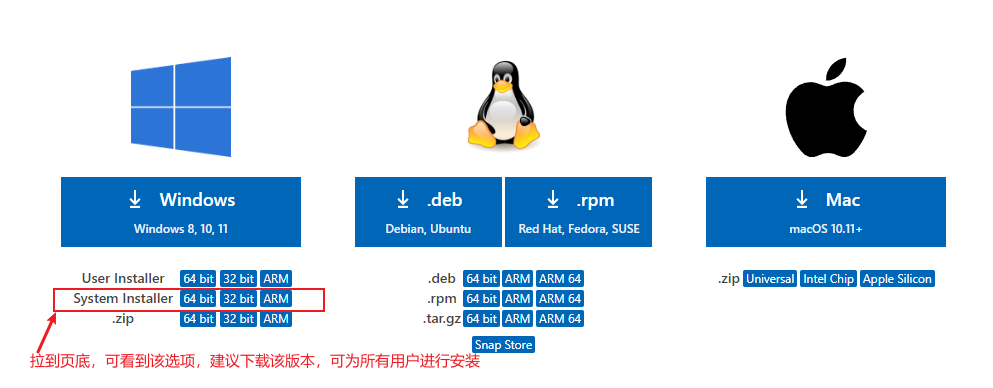

# 1. VSCode 使用指南 - 入门篇

- [1. VSCode 使用指南 - 入门篇](#1-vscode-使用指南---入门篇)
  - [1.1. 安装与配置VSCode](#11-安装与配置vscode)
  - [1.2. VSCode 插件配置](#12-vscode-插件配置)
    - [1.2.1. Markdown](#121-markdown)
    - [1.2.2. VSCode 配置同步](#122-vscode-配置同步)
    - [1.2.3. Python](#123-python)
    - [1.2.4. C/C++](#124-cc)
  - [1.3. FAQ](#13-faq)
    - [1.3.1. Q: VSCode提示安装似乎损坏，请重新安装](#131-q-vscode提示安装似乎损坏请重新安装)
    - [1.3.2. remote-ssh 远程连接时报错 Bad owner or permissions on xxxx/.ssh/config](#132-remote-ssh-远程连接时报错-bad-owner-or-permissions-on-xxxxsshconfig)

## 1.1. 安装与配置VSCode

**步骤1：先为 VScode 配置用户数据目录以及扩展安装目录：**

- 用户数据目录默认为：`C:\Users\[用户名]\AppData\Roaming\Code\`
- 扩展安装目录默认为：`C:\Users\[用户名]\.vscode\`

有两种方法修改这两个目录：

1. 方法一：是通过命令来启动 *VSCode*：`code --user-data-dir "[用户数据目录]" --extensions-dir "[扩展安装目录]"` 或 `[VSCode安装目录]/Code.exe --user-data-dir "[用户数据目录]" --extensions-dir "[扩展安装目录]"`。
2. 方法二：是通过创建文件夹链接，详见默认的目录删除掉，执行 CMD 命令：`mklink /d "C:\Users\[用户名]\AppData\Roaming\Code\" "[自定义的用户数据目录]"` 和 `mklink /d "C:\Users\[用户名]\.vscode\" "[自定义的扩展安装目录]"`。

**步骤2：下载 VSCode：**

到 [VSCode 官网](https://code.visualstudio.com/) 下载的最新版本。并按照提示进行安装。

## 1.2. VSCode 插件配置

### 1.2.1. Markdown

- Markdown All in One：[官方文档](extensions/markdown_all_in_one.md)
- Markdown + Math：[官方文档](extensions/markdown+math.md)
- Markdownlint：[官方文档](extensions/markdown_lint.md)

### 1.2.2. VSCode 配置同步

- Settings sync: [官方文档](extensions/settings_sync.md)

### 1.2.3. Python

- Microsoft官方 *Python* 插件: [官方文档](extensions/python.md)

### 1.2.4. C/C++

- Microsoft官方 *C/C++* 插件: [官方文档](extensions/C_C++.md)
- Microsoft官方 *Makefile Tools* 插件: [官方文档](extensions/makefile_tools.md)

## 1.3. FAQ

### 1.3.1. Q: VSCode提示安装似乎损坏，请重新安装

大概率是安装了 *background* 插件导致的，解决方法如下：

1. 卸载 *background* 插件。
2. 安装 *Fix VSCode Checksums*，并运行命令 `Fix Checksums: Apply`。然后重启即可。

### 1.3.2. remote-ssh 远程连接时报错 Bad owner or permissions on xxxx/.ssh/config

目前该错误发生在 *Windows 10*　环境下，解决办法如下：

1. 找到错误中的 *config* 文件，`右键 -> 属性 -> 安全 -> 高级 -> 禁用继承 -> 删除所有继承权限 -> 确定`
2. 同样地，在 *config* 文件上 `右键 -> 属性 -> 安全 -> 编辑 -> 添加 -> 高级 -> 立即查找 -> 找到自己的用户名并选择 -> 然后勾选 "修改"、"读取和执行"、"读取" 和 "写入" 权限即可`

> 原文链接：[vscode中报错Bad owner or permissions on C:\\Users\\user-name/.ssh/config](https://blog.csdn.net/weixin_37707670/article/details/108831132)
