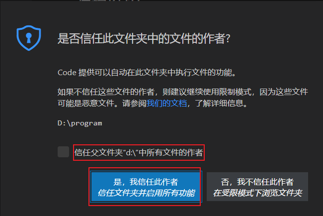
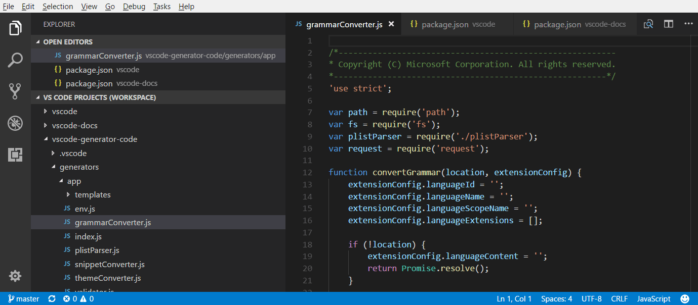
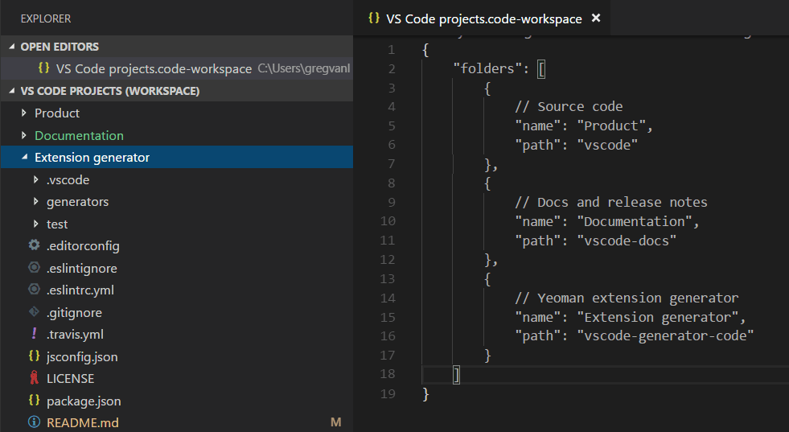
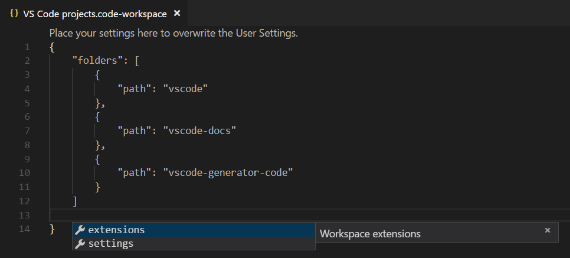
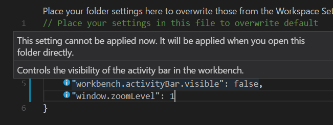
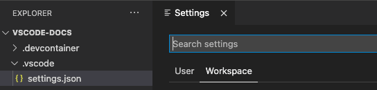
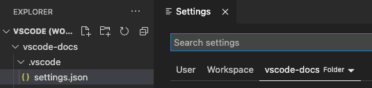
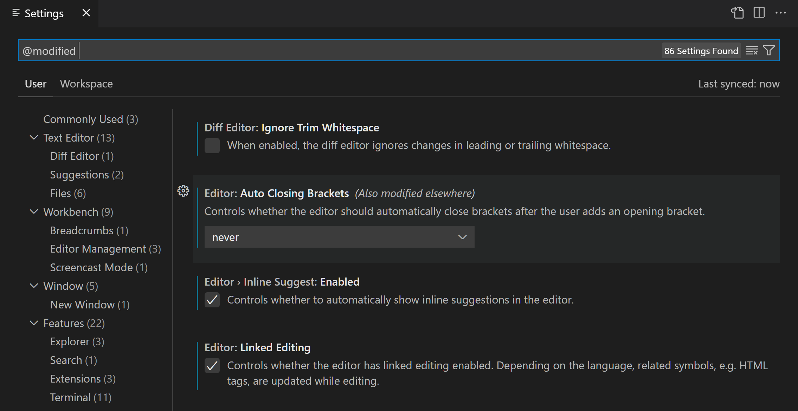

# 1. What is a VS Code "workspace"?

Table of Contents

- [1. What is a VS Code "workspace"?](#1-what-is-a-vs-code-workspace)
  - [1.1. 简介](#11-简介)
  - [1.2. 单目录工作区(Single-folder workspaces)](#12-单目录工作区single-folder-workspaces)
    - [1.2.1. 创建单目录工作区](#121-创建单目录工作区)
    - [1.2.2. 删除单目录工作区](#122-删除单目录工作区)
  - [1.3. Multi-root workspaces](#13-multi-root-workspaces)
    - [1.3.1. 创建 Multi-root workspaces](#131-创建-multi-root-workspaces)
    - [1.3.2. 打开 Multi-root workspaces](#132-打开-multi-root-workspaces)
    - [1.3.3. 工作区文件的结构](#133-工作区文件的结构)
    - [1.3.4. 与 Multi-root workspaces 有关的通用 UI 的改变](#134-与-multi-root-workspaces-有关的通用-ui-的改变)
      - [1.3.4.1. Editor](#1341-editor)
      - [1.3.4.2. Search](#1342-search)
    - [1.3.5. 设置](#135-设置)
  - [1.4. 工作区设置](#14-工作区设置)
    - [1.4.1. 单目录工作区的设置](#141-单目录工作区的设置)
    - [1.4.2. Multi-root workspace的设置](#142-multi-root-workspace的设置)
    - [1.4.3. 设置过滤器](#143-设置过滤器)
    - [1.4.4. 设置优先级](#144-设置优先级)
  - [1.5. 工作区的tasks 和 launch configurations](#15-工作区的tasks-和-launch-configurations)
  - [1.6. FQA](#16-fqa)
    - [1.6.1. 相较于使用单目录工作区，*Multi-root workspaces* 的优势在哪儿？](#161-相较于使用单目录工作区multi-root-workspaces-的优势在哪儿)
    - [1.6.2. 我可以使用没有文件夹的多根工作区吗](#162-我可以使用没有文件夹的多根工作区吗)
  - [1.7. 参考链接](#17-参考链接)

## 1.1. 简介

*Visual Studio Code* “工作区”是在 *VS Code* 窗口（实例）中打开的一个或多个文件夹的集合。在大多数情况下，您将打开一个文件夹作为工作区，但根据您的开发工作流程，您可以使用称为 [Multi-root workspaces](https://code.visualstudio.com/docs/editor/workspaces#_multiroot-workspaces) 的高级配置包含多个文件夹。

工作区的概念使 VS Code 能够：

- 配置仅适用于特定文件夹，但不适用于其他文件夹的设置。
- 保留仅在该工作区的上下文中有效的 [task](https://code.visualstudio.com/docs/editor/tasks) 和 [调试器启动配置](https://code.visualstudio.com/docs/editor/debugging)。
- 存储和恢复与该工作区关联的 UI 状态（例如，打开的文件）
- 仅为该工作区选择性地启用或禁用扩展。

> 注：也可以在没有工作区的情况下打开 VS Code。例如，当您通过从平台的文件菜单中选择一个文件来打开一个新的 VS Code 窗口时，您将不会在工作区中。**在这种模式下，VS Code 的功能会受限**，但您仍然可以打开文本文件并对其进行编辑。

## 1.2. 单目录工作区(Single-folder workspaces)

### 1.2.1. 创建单目录工作区

除了使用 VS Code 打开文件夹外，您无需对文件夹进行任何操作即可成为 VS Code 工作区：你只需要在 *VS Code* 中打开文件夹，然后选择信任即可：



该目录就会成为被信任的工作区，之后您就可以在该工作区添加特定于其他文件夹的配置，例如特定于工作区的设置（相对于全局用户设置）、任务定义和调试启动文件（请参阅下面的工作区设置部分）。

### 1.2.2. 删除单目录工作区

1. 通过命令面板（Ctrl + Shift + P）输入命令：`Workspaces: Remove folder from workspaces`，即可将该目录从工作区中删除
2. 通过命令面板（Ctrl + Shift + P）输入命令：`Manage workspace Trust`，将该目录从信任的工作区中删除

## 1.3. Multi-root workspaces

*Multi-root workspaces* 是 *VS Code* 的一项高级功能，允许您将多个不同的文件夹配置为工作区的一部分。*Multi-root workspaces* 是通过一个名为 `<name>.code-workspace` 的 *JSON* 文件来进行管理的，而不是将文件夹直接作为工作区打开。例如：

```json
{
    "folders": [
        {
            "path": "emulator_client_hk-dev_arnicedeng_support_sgx"
        },
        {
            "path": "test
        }
    ],
    "settings": {}
}
```

*Multi-root workspaces* 通常用于在 *VS Code* 中管理过个项目，尤其是多个相关联的项目。例如，您可能有一个存储库，其中包含您希望在更新产品源代码时保持最新的产品文档。



### 1.3.1. 创建 Multi-root workspaces

1. 添加文件夹到工作区：首先在 *VS Code* 中打开文件夹，然后在 `File > Add Folder to Workspace` 或在命令面板（Ctrl + Shift + P）中运行命令：`Workspaces: Add Folder to Workspace`，将一个文件夹添加到工作区，此时 *VS Code* 会创建一个 “无标题(工作区)”，并在后台维护一个 `untitled.code-workspace` 文件。
2. 保存工作区：在 `文件 > 将工作区另存为` 或在命令面板（Ctrl + Shift + P）中运行命令：`Workspaces: Save worksapce as...`，之后会出现一个提示框，会让你选择在你选择目录生成一个由你命名的 `xxx.code-workspace` 文件，该文件的名字即为工作区的名字。

> 注1：在 *Multi-root workspaces* 中，你可以很方便地通过命令：`Workspaces: Add Folder to Workspace` 与 `Workspaces: Remove Folder from Workspace` 来在工作区中添加和删除目录。
>
> 注2：您可以使用拖放将文件夹添加到工作区。将文件夹拖到文件资源管理器以将其添加到当前工作区。您甚至可以选择并拖动多个文件夹。（在没有打开工作区时，将单个文件夹拖放到 VS Code 的编辑器区域仍然会以单个文件夹模式打开该文件夹，如果将多个文件夹拖放到编辑器区域，将创建一个新的多根工作区。）
>
> 注3：也可以使用 `code` 命令来创建 *Multi-root workspaces*，如：`code --add vscode vscode-docs`
>
> 注4：你也可以通过将工作区另存为命令来将工作区移动到其他目录。

### 1.3.2. 打开 Multi-root workspaces

1. 方法1：随便打开一个 *VS Code*，在 `文件 > 从文件打开工作区` 或在命令面板（Ctrl + Shift + P）中运行命令：`File: Open workspace from file`，选择你想打开的 `.code-workspace` 文件即可。
2. 方法2：如果是在 *Windows* 上，你可以双击 `.code-workspace` 文件来打开该工作区。

> 注：就像在 *VS Code* 中打开单个文件夹时关闭文件夹一样，有一个关闭工作区 (`Ctrl+K F`) 命令来关闭活动工作区

### 1.3.3. 工作区文件的结构

`.code-workspace` 的架构相当简单。您有一组具有绝对或相对路径的文件夹。当您想要共享 *Workspace* 文件时，相对路径会更好。

您可以使用 `name` 属性覆盖文件夹的显示名称，以便为资源管理器中的文件夹提供更有意义的名称。例如，您可以将项目文件夹命名为“产品”和“文档”，以便通过文件夹名称轻松识别内容：

```json
{
  "folders": [
    {
      // Source code
      "name": "Product",
      "path": "vscode"
    },
    {
      // Docs and release notes
      "name": "Documentation",
      "path": "vscode-docs"
    },
    {
      // Yeoman extension generator
      "name": "Extension generator",
      "path": "vscode-generator-code"
    }
  ]
}
```

这将导致以下资源管理器显示：



`.code-workspace` 文件还可以包含 *Settings* 下的 *Workspace* 全局设置和 *extensions* 下的扩展建议，我们将在下面讨论。



### 1.3.4. 与 Multi-root workspaces 有关的通用 UI 的改变

#### 1.3.4.1. Editor

当您使用多根工作区时，VS Code UI 只发生了一些变化，主要是为了消除文件夹之间的文件歧义。例如，如果多个文件夹中的文件之间存在名称冲突，VS Code 将在选项卡式标题中包含文件夹名称。

如果您总是希望看到选项卡式标题中显示的文件夹，您可以使用 `workbench.editor.labelFormat` 设置 “medium” 或 “long” 值来显示文件夹或完整路径。

*VS Code UI*，例如 *OPEN EDITORS* 和 *Quick Open (Ctrl+P)* 列表将列出文件夹名称。

> 如果您使用的是文件图标主题并且活动主题支持它，您将看到一个特殊的工作区图标。

#### 1.3.4.2. Search

全局搜索等 VS Code 功能适用于所有文件夹，并按文件夹对搜索结果进行分组。当您打开多根工作区时，您可以选择在要包含的文件框中使用 ./ 语法在单个根文件夹中进行搜索。例如，如果您输入 ./project1/**/*.txt，则会搜索 project1/ 根文件夹下的所有 .txt 文件。

### 1.3.5. 设置

> **注意**：在工作区/文件夹级别的设置，当打开这个工作区/文件夹时，会覆盖用户的设置，如果工作区/文件夹级别的设置缺省的话，则会沿用用户的设置。

如果在一个工作区中有多个根文件夹，则可以在每个根文件夹中有一个 `.vscode` 文件夹，定义应该应用于该文件夹的设置。为避免设置冲突，使用多根工作区时仅应用资源（文件、文件夹）设置。**影响整个编辑器的设置（例如 UI 布局）将被忽略**。例如，两个项目不能同时设置缩放级别。

与单文件夹项目一样支持用户设置，您还可以设置将应用于多根工作区中所有文件夹的全局工作区设置。全局工作区设置将存储在您的 `.code-workspace` 文件中。

您还可以使用以下命令打开特定的设置文件：

- `Preferences: Open User Settings`: 打开您的全局用户设置
- `Preferences: Open Workspace Settings`: 打开工作区文件的设置部分。
- `Preferences: Open Folder Settings`: 打开活动文件夹的设置。

不受支持的编辑器范围的文件夹设置将在您的文件夹设置中显示为灰色，并从默认文件夹设置列表中过滤掉。您还将在设置前面看到一个信息图标。



## 1.4. 工作区设置

工作区设置使您能够在已打开的工作区的上下文中配置设置，并始终覆盖全局用户设置。它们物理存储在 JSON 文件中，它们的位置取决于您是打开文件夹作为工作空间还是打开 `.code-workspace` 文件。

> 有关设置范围及其文件位置的全面说明，请参阅 [设置文档](https://code.visualstudio.com/docs/getstarted/settings)。

### 1.4.1. 单目录工作区的设置

当您将文件夹打开为工作空间时，工作空间设置将存储在 .vscode/settings.json 中。



### 1.4.2. Multi-root workspace的设置

当您打开 `.code-workspace` 作为工作区时，所有工作区设置都将添加到 `.code-workspace` 文件中。但是您仍然可以为每个根文件夹配置设置，设置编辑器将显示第三个设置范围，称为文件夹设置：



每个文件夹配置的设置将覆盖 `.code-workspace` 中定义的设置

### 1.4.3. 设置过滤器

可以在打开设置(UI)后，使用 `@modified` 过滤器，检查您配置了哪些设置。如果设置的值与默认值不同，或者如果其值在相应的设置 JSON 文件中明确设置，则会在此过滤器下显示设置。



以下是一些可用的过滤器：

- `@ext`: 特定于扩展的设置。您提供扩展 ID，例如 `@ext:ms-python.python`。
- `@feature`: 特定于功能子组的设置。例如，`@feature:explorer` 显示文件资源管理器的设置。
- `@id`: 根据设置 ID 查找设置。例如，`@id:workbench.activityBar.visible`。
- `@lang`: 根据语言 ID 应用语言过滤器。例如，`@lang:typescript`。有关更多详细信息，请参阅 [特定于语言的编辑器设置](https://code.visualstudio.com/docs/getstarted/settings#_language-specific-editor-settings)。
- `@tag`: 特定于 *VS Code* 系统的设置。例如，`@tag:workspaceTrust` 用于与 *Workspace Trust* 相关的设置

### 1.4.4. 设置优先级

不同的设置范围可以在多个级别上覆盖配置。在以下列表中，后面的作用域会覆盖前面的作用域：

- **默认设置** - 此范围表示默认的未配置设置值。
- **用户设置** - 全局应用于所有 VS Code 实例
- **远程设置** - 应用于用户打开的远程机器。
- **工作区设置** - 应用于打开的文件夹或工作区。
- **工作区文件夹设置** - 应用于多根工作区的特定文件夹
- **特定于语言的默认设置** - 这些是可以由扩展提供的特定于语言的默认值。
- **特定于语言的用户设置** - 与用户设置相同，但特定于一种语言。
- **特定于语言的远程设置** - 与远程设置相同，但特定于一种语言。
- **特定于语言的工作区设置** - 与工作区设置相同，但特定于一种语言。
- **特定于语言的工作区文件夹设置** - 与工作区文件夹设置相同，但特定于一种语言。
- **策略设置** - 由系统管理员设置，这些值始终覆盖其他设置值。

设置值可以有多种类型：

- 字符串 - `“files.autoSave”：“afterDelay”`
- 布尔值 - `“editor.minimap.enabled”：true`
- 数字 - `“files.autoSaveDelay”：1000`
- 数组 - `“editor.rulers”：[]`
- 对象 - `"search.exclude": { "**/node_modules": true, "**/bower_components": true }`

具有原始类型和数组类型的值被覆盖。但是，具有 Object 类型的值被合并。例如，`workbench.colorCustomizations` 接受一个指定一组 UI 元素及其所需颜色的对象。如果您的用户设置将编辑器背景设置为蓝色和绿色：

```json
 "workbench.colorCustomizations": {
    "editor.background": "#000088",
    "editor.selectionBackground": "#008800"
  }
```

并且您打开的工作区设置将编辑器前景设置为红色：

```json
  "workbench.colorCustomizations": {
    "editor.foreground": "#880000",
    "editor.selectionBackground": "#00FF00"
  }
```

当该工作区打开时，结果是这两种颜色自定义的组合，就像您指定了一样:

```json
  "workbench.colorCustomizations": {
    "editor.background": "#000088",
    "editor.selectionBackground": "#00FF00",
    "editor.foreground": "#880000"
  }
```

## 1.5. 工作区的tasks 和 launch configurations

与工作空间设置特定于工作空间的方式类似，任务和启动配置也可以限定为工作空间。根据您是打开文件夹作为工作空间还是打开 `.code-workspace` 文件，工作区任务和启动配置的位置将位于 `.vscode` 文件夹内或 `.code-workspace` 文件内。 此外，即使您打开了 `.code-workspace` 文件，也始终可以在文件夹级别定义任务和启动配置。

> 有关如何在 *VS Code* 中使用任务和启动配置的更全面的概述，请参阅 [任务](https://code.visualstudio.com/docs/editor/tasks) 和 [调试](https://code.visualstudio.com/docs/editor/debugging) 章节。

使用多根工作区，*VS Code* 在所有文件夹中搜索 `launch.json` 调试配置文件，并以文件夹名称作为后缀显示它们。此外，*VS Code* 还将显示工作区配置文件中定义的启动配置。

`Add Config` 命令将打开文件夹的 `.vscode` 子文件夹中的现有 `launch.json` 文件，或者创建一个新文件并显在示调试配置模板下拉菜单中。

> 注：配置中使用的[变量](https://code.visualstudio.com/docs/editor/variables-reference)（例如 `${workspaceFolder}` 或现在已弃用的 `${workspaceRoot}`）相对于它们所属的文件夹进行解析。可以通过将根文件夹的名称附加到变量（用冒号分隔）来为每个工作区文件夹定义一个变量

## 1.6. FQA

### 1.6.1. 相较于使用单目录工作区，*Multi-root workspaces* 的优势在哪儿？

最明显的优势是多根工作区允许您处理多个项目，这些项目可能未存储在磁盘上的同一父文件夹中。您可以从任何地方选择文件夹以添加到工作区。

即使您主要在基于单个文件夹的项目中工作，您也可以从使用 `.code-workspace` 文件中受益。您可以在文件夹中存储多个 `.code-workspace` 文件，以根据场景提供项目某些方面的范围文件夹视图（例如 `client.code-workspace`、`server.code-workspace` 从文件资源管理器中过滤掉不相关的文件夹）。由于 `.code-workspace` 文件支持文件夹部分的相对路径，因此这些工作空间文件将适用于每个人，而与文件夹的存储位置无关。

最后，如果对于某些项目，您想应用相同的工作区设置或任务/启动配置集，请考虑将它们添加到 `.code-workspace` 文件中并从该工作区添加/删除这些文件夹。

### 1.6.2. 我可以使用没有文件夹的多根工作区吗

可以将 `.code-workspace` 文件的文件夹部分留空，这样您最终会得到一个不显示任何根文件夹的 VS Code 实例。在这种情况下，您仍然可以存储工作区设置甚至任务或启动配置。

## 1.7. 参考链接

- [1] [What is a VS Code "workspace"?](https://code.visualstudio.com/docs/editor/workspaces) [j].code.visualstudio.com
- [2] [Multi-root Workspaces](https://code.visualstudio.com/docs/editor/multi-root-workspaces) [j].code.visualstudio.com
