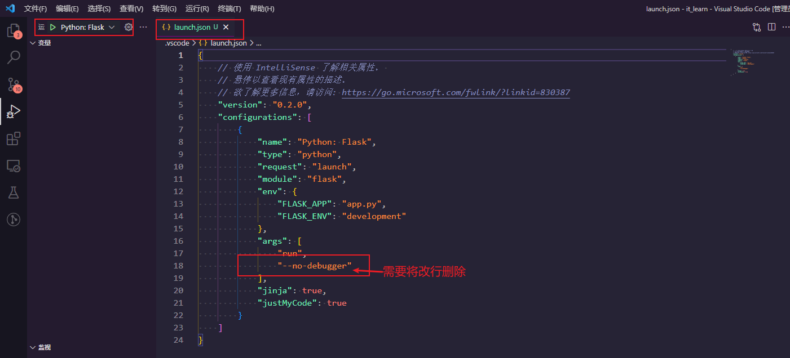

# 1. Visual Studio Code 的 Python 扩展

Table of Contents

- [1. Visual Studio Code 的 Python 扩展](#1-visual-studio-code-的-python-扩展)
  - [1.1. 简介](#11-简介)
  - [1.2. Quick Start](#12-quick-start)
  - [1.3. 设置你的环境](#13-设置你的环境)
    - [1.3.1. 设置 *Python* 解释器](#131-设置-python-解释器)
    - [1.3.2. 配置 *Python* 调试器](#132-配置-python-调试器)
    - [1.3.3. 配置测试](#133-配置测试)
  - [1.4. Jupyter Notebook quick start](#14-jupyter-notebook-quick-start)
  - [1.5. 有用的命令](#15-有用的命令)
  - [1.6. 功能详情](#16-功能详情)

## 1.1. 简介

对 *Python* 语言具有丰富支持的 [Visual Studio Code 扩展](https://marketplace.visualstudio.com/items?itemName=ms-python.python)（对于所有积极支持的语言版本：>=3.7）。包括 `IntelliSense (Pylance)`、`linting`、调试、代码导航、代码格式化、重构、变量资源管理器、测试资源管理器等功能！

在 [vscode.dev](https://vscode.dev/)（包括 github.dev）上运行时，Python 扩展确实提供了一些支持。这包括在编辑器中打开文件的部分 IntelliSense。

> vscode.dev 是可以通过浏览器打开的，在线 *vscode* 编辑器的入口网址。

*Python* 扩展将自动安装 [*Pylance*](https://marketplace.visualstudio.com/items?itemName=ms-python.vscode-pylance) 和 [*Jupyter*](https://marketplace.visualstudio.com/items?itemName=ms-toolsai.jupyter) 扩展，以便在使用 *Python* 文件和 *Jupyter* 笔记本时为您提供最佳体验。但是，*Pylance* 是一个可选依赖项，这意味着如果安装失败，*Python* 扩展将保持完整功能。如果您使用不同的语言服务器，您也可以以牺牲某些功能为代价来卸载它。

## 1.2. Quick Start

1. 在您的系统上安装支持的 *Python* 版本（注意：不支持在 *macOS* 上系统安装 *Python*）。
2. 在 *VSCode* 上安装该插件
3. 打开或创建 Python 文件并开始编码！

## 1.3. 设置你的环境

### 1.3.1. 设置 *Python* 解释器

在 *VSCode* 的命令面板（Ctrl + Shift + P）中输入 `python select interpreter`：

然后在弹出的对话框中，选择您的 *Python* 解释器即可：

### 1.3.2. 配置 *Python* 调试器

首先要打开一个 *Python* 文件，然后按照下图的步骤进行选择：

> 注：**在没有打开 *Python* 文件的情况下进行选择， 是不会出现 Flask 这个选项的。**

然后确认 *Flask* 作为 *Python* 的调试器：

最后会生成一个 `launch.json` 的文件，以及 `Python: Flask` 的选项：

### 1.3.3. 配置测试

在命令面板（Ctrl + Shift + P）中运行命令：`Configure Tests`

## 1.4. Jupyter Notebook quick start

Python 扩展和 [Jupyter 扩展](https://marketplace.visualstudio.com/items?itemName=ms-toolsai.jupyter) 协同工作，为您在 VS Code 中提供出色的 Notebook 体验。

打开或创建一个 Jupyter Notebook 文件 (.ipynb) 并在我们的 Notebook Editor 中开始编码！如需更多信息，您可以：

- 按照我们的 [Python 教程](https://code.visualstudio.com/docs/python/python-tutorial#_prerequisites) 逐步说明构建一个简单的应用程序。
- 查看 [VS Code 站点上的 Python 文档](https://code.visualstudio.com/docs/languages/python)，了解有关使用扩展的一般信息。
- 查看 [VS Code 站点上的 Jupyter Notebook 文档](https://code.visualstudio.com/docs/python/jupyter-support)，了解有关在 VS Code 中使用 Jupyter Notebook 的信息。

## 1.5. 有用的命令

| 命令                                  | 描述                                                                                                              |
| :------------------------------------ | :---------------------------------------------------------------------------------------------------------------- |
| `Python: Select Interpreter`          | 在 Python 解释器、版本和环境之间切换。                                                                            |
| `Python: Start REPL`                  | 在 VS Code 终端中使用选定的解释器启动交互式 Python REPL                                                           |
| `Python: Run Python File in Terminal` | 在 VS Code 终端中运行活动的 Python 文件。您还可以通过右键单击文件并选择在终端中运行 Python 文件来运行 Python 文件 |
| `Python: Select Linter`               | 从 Pylint 切换到 Flake8 或其他受支持的 linter。                                                                   |
| `Format Document`                     | 使用 settings.json 文件中提供的格式化程序格式化代码。                                                             |
| `Python: Configure Tests`             | 选择一个测试框架并将其配置为显示测试资源管理器                                                                    |

要查看所有可用的 Python 命令，请打开命令面板并键入 `Python`。对于 Jupyter 扩展命令，只需键入 `Jupyter`。

## 1.6. 功能详情

详细了解 Python 扩展的丰富功能：

- [IntelliSense](https://code.visualstudio.com/docs/python/editing#_autocomplete-and-intellisense)：使用自动完成、代码导航、语法检查等功能编辑您的代码
- [Linting](https://code.visualstudio.com/docs/python/linting)：使用 Pylint、Flake8 等获得额外的代码分析
- [Code formatting](https://code.visualstudio.com/docs/python/editing#_formatting): 使用 black、autopep 或 yapf 格式化您的代码
- [Debugging](https://code.visualstudio.com/docs/python/debugging): 调试您的 Python 脚本、Web 应用程序、远程或多线程进程
- [Testing](https://code.visualstudio.com/docs/python/unit-testing): 使用 unittest 或 pytest 通过测试资源管理器运行和调试测试
- [Jupyter Notebooks](https://code.visualstudio.com/docs/python/jupyter-support): 创建和编辑 Jupyter Notebooks、添加和运行代码单元、渲染绘图、通过变量浏览器可视化变量、使用数据查看器可视化数据帧等等
- [Environments](https://code.visualstudio.com/docs/python/environments): 在 virtualenv、venv、pipenv、conda 和 pyenv 环境之间自动激活和切换
- [Refactoring](https://code.visualstudio.com/docs/python/editing#_refactoring): 使用变量提取、方法提取和导入排序重构您的 Python 代码
