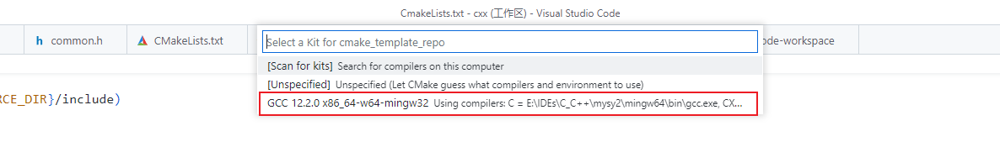
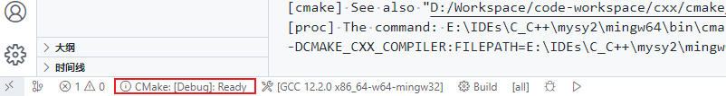
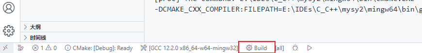

# 1. 搭建与配置 C/C++ 开发环境

Table of Contents

- [1. 搭建与配置 C/C++ 开发环境](#1-搭建与配置-cc-开发环境)
  - [1.1. 安装编译器](#11-安装编译器)
    - [1.1.1. Windows 安装 MinGW-x64](#111-windows-安装-mingw-x64)
    - [1.1.2. Linux 安装 GCC](#112-linux-安装-gcc)
  - [1.2. 配置 C/C++ 扩展](#12-配置-cc-扩展)
  - [1.3. 配置 VS Code 自带的编译与调试选项](#13-配置-vs-code-自带的编译与调试选项)
    - [1.3.1. 配置编译任务](#131-配置编译任务)
      - [1.3.1.1. 配置 MakeFile 作为编译工具](#1311-配置-makefile-作为编译工具)
      - [1.3.1.2. 配置 CMake 作为编译工具](#1312-配置-cmake-作为编译工具)
    - [1.3.2. 配置 C/C++ 调试](#132-配置-cc-调试)
  - [1.4. 使用 CMake Tools 插件进行构建与调试项目](#14-使用-cmake-tools-插件进行构建与调试项目)
    - [1.4.1. 选择一个编译 Kits](#141-选择一个编译-kits)
    - [1.4.2. 选择一个 variant](#142-选择一个-variant)
    - [1.4.3. CMake: Configure](#143-cmake-configure)
    - [1.4.4. 扩展阅读](#144-扩展阅读)
  - [1.5. 参考链接](#15-参考链接)

## 1.1. 安装编译器

### 1.1.1. Windows 安装 MinGW-x64

*Minimalist GNU for Windows (MinGW) C++* 工具（编译器和调试器）是适用于 *Windows* 的流行的免费工具集。我们将通过 [MSYS2](https://www.msys2.org/) 安装 *Mingw-w64*，它提供 *GCC*、*Mingw-w64* 和其他有用的 *C++* 工具和库的最新本地构建。

您可以从 [*MSYS2* 页面](https://www.msys2.org/) 下载最新的安装程序。


> **说明：** *MSYS2* 是 *Windows* 的软件分发和构建平台。它包含一个名为 *mintty*、*bash* 的命令行终端、*git* 和 *subversion* 等版本控制系统、*tar* 和 *awk* 等工具，甚至还有 *autotools* 等构建系统，所有这些都基于 *Cygwin* 的修改版本。 尽管其中一些核心部分基于 *Cygwin*，但 *MSYS2* 的主要重点是为本地 *Windows* 软件提供构建环境，并且使用 *Cygwin* 的部分保持在最低限度。 *MSYS2* 为 *GCC*、*mingw-w64*、*CPython*、*CMake*、*Meson*、*OpenSSL*、*FFmpeg*、*Rust*、*Ruby* 等提供最新的原生构建。

安装 *MSYS2* 后，运行它（在 *Windows* 的搜索框中直接搜索 *MSYS2* 即可找到它），输入命令：`pacman -S --needed base-devel mingw-w64-x86_64-toolchain` 来安装 `MinGW-x64`


安装完成 *Mingw-w64* 后，需要将 `gcc.exe/g++.exe` 添加到系统环境变量中：在 *Windows* 搜索框中搜索 "Mingw-w64"，打开该终端，输入 `gcc --version`，若能正确输出 *gcc* 版本，则说明已经安装成功，此时通过命令 `where gcc` 找到 `gcc.exe` 的安装路径，将 `gcc.exe` 所在的 *bin* 目录的路径添加到 `%PATH` 环境变量中，


之后，可以在任意终端上（*MSYS2* 终端除外）输入命令：`g++ --version` 来查看是否安装成功。最后，在 *MSYS2* 终端上可通过命令 `pacman -Suy` 来更新所有的已安装的包。

> **说明**：安装 MSYS2 后，它将通过 pacman 进行自我更新，有关更多信息，请参阅 [更新指南](https://www.msys2.org/docs/updating/)
>
> **建议**：将 *MSYS2* 终端加入到 *Windows Terminal* 中，以便进行管理。

### 1.1.2. Linux 安装 GCC

to be continue..

## 1.2. 配置 C/C++ 扩展

**找到 `g++` 编译器的路径:**

- 在 *Windows* 上，打开命令提示符（*CMD*），通过命令：`where g++`，即可找到 *g++* 的路径
- 在 *Linux* 上，通过命令：`locate g++` 或 `type g++`，即可找到 *g++* 的路径

**配置编译器路径**：在命令面板（`Ctrl + Shift + P`）输入命令 `C/C++: Edit Configurations(UI)`，进入到 *C/C++ 扩展* 的配置界面，将 *g++* 的路径配置到指定位置。

**配置 IntelliSense 模式**：如果用的是 *MinGW64* 提供的 *g++* 编译器，这里需要配置成 `windows-gcc-x64`


**找到本机 *C++* 环境的包含路径**：在任意终端上（*MSYS2* 的终端除外）输入命令：`gcc -v -E -x c++ -`，即可找到本机 *C++* 环境的包含路径：


> **说明**：如果不为配置 *VS Code* 配置包含路径的话，默认情况下，扩展搜索当前源目录、其子目录和一些特定于平台的位置。

**配置包含路径以及 C++ 版本**：


> **注意**：一般将 `${workspaceFolder}/**` 配置在工作区/文件夹的级别的配置中，表示包含本工作区下面的所有源文件。所有项目都要用到的包含路径，比如 *C++* 环境的包含路径以及一些第三方公共库的包含路径，都可以放到 *C/C++* 插件的用户级别或全局默认的配置中。
>
> 在命令面板（`Ctrl + Shift + P`）中输入命令：`Preferences: Open Settings (UI)`，打开 *VS Code* 的设置界面，搜索 `@ext:ms-vscode.cpptools`，列出 *C/C++ 扩展* 的配置，在这里就可以进行用户/工作区/文件夹等级别的配置
>
> 

配置完成后，C/C++ 扩展就能正常的进行语法提示、跳转了。

## 1.3. 配置 VS Code 自带的编译与调试选项

### 1.3.1. 配置编译任务

#### 1.3.1.1. 配置 MakeFile 作为编译工具

**首先安装 make**: 如果是 *Windows* 并且采用的是 *MSYS2* 安装的 *MinGW* 作为 *C++* 环境,那么通过以下命令确认是否安装了 `make`

```bash
# pacman基本命令:
pacman -Sy 更新软件包数据 
pacman -Syu 更新所有 
pacman -Ss xx 查询软件xx的信息 
pacman -S xx 安装软件xx
pacman -R xx 删除软件xx

# 1. 通过在命令提示符(CMD) 中输入以下命令,确认是否安装有 mingw 相关的 make
mingw32-make -v
where mingw32-make

# 1. 安装 mingw32-make
pacman -S mingw-w64-x86_64-make
```

> Linux/MacOs 上安装 `make` 跟 `gdb` 的方法请自行查阅相关资料

**创建构建（编译、链接等）任务**: 在命令面板中(`Ctrl + Shift + P`)输入命令: `Tasks: Open User Task`/`Task: Open workspace task`. 来打开用户级别/工作区级别的编译任务的配置文件,如果没有则会提示根据模板创建一个,这里选择根据其他模板进行创建即可, 创建得到的 `tasks.json` 文件:

```json
{
    // See https://go.microsoft.com/fwlink/?LinkId=733558
    // for the documentation about the tasks.json format
    "version": "2.0.0",
    "tasks": [
        {
            "label": "echo",
            "type": "shell",
            "command": "echo Hello"
        }
    ]
}
```

修改该 `tasks.json`, 创建三个 `make` 命令:

```json
{
    // See https://go.microsoft.com/fwlink/?LinkId=733558
    // for the documentation about the tasks.json format
    "version": "2.0.0",
    "tasks": [
        {
            // label 标签指定了这个 task 的名称标识 (必须唯一)
            "label": "build",
            "args": [],
            "type": "shell",
            "command": "make"
        },
        {
            "label": "build_debug",
            "type": "shell",
            "command": "make",
            "args": ["debug"]
        },
        {
            "label": "clean",
            "type": "shell",
            "command": "make",
            "args": ["clean"]
        }
    ]
}
```

#### 1.3.1.2. 配置 CMake 作为编译工具

**首先安装 make**: 如果是 *Windows* 并且采用的是 *MSYS2* 安装的 *MinGW* 作为 *C++* 环境,那么通过以下命令确认是否安装了 `cmake`

```bash
# 1. 通过在命令提示符(CMD) 中输入以下命令,确认是否安装有 mingw 相关的 make
cmake --version
where cmake

# 1. 安装 cmake
pacman -S mingw-w64-x86_64-cmake mingw-w64-x86_64-extra-cmake-modules
```

同 *Makefile* 的编译任务配置，将 *command* 字段改成 *cmake* 相关的命令即可

### 1.3.2. 配置 C/C++ 调试

**首先安装 gdb**:如果是 *Windows* 并且采用的是 *MSYS2* 安装的 *MinGW* 作为 *C++* 环境,那么通过以下命令确认是否安装了 `gdb`.

```bash
# 1. 通过在命令提示符(CMD) 中输入以下命令,确认是否安装有 mingw 相关的 gdb
gdb -v
where gdb

# 1. 安装 gdb
pacman -S mingw-w64-x86_64-gdb
```

> Linux/MacOs 上安装 `make` 跟 `gdb` 的方法请自行查阅相关资料

**创建 launch.json 文件**: 使用快捷键 `Ctrl + Shift + D` 打开运行和调试侧边栏, 点击 "创建 launch.json 文件":


选择项目名/文件夹名(为项目创建调试配置):


然后根据系统环境选择对应的调试程序


最终默认生成的 `launch.json` 文件如下:

```json
{
    // 使用 IntelliSense 了解相关属性。 
    // 悬停以查看现有属性的描述。
    // 欲了解更多信息，请访问: https://go.microsoft.com/fwlink/?linkid=830387
    "version": "0.2.0",
    "configurations": []
}
```

将该文件修改为:

```json
{
    // 使用 IntelliSense 了解相关属性。 
    // 悬停以查看现有属性的描述。
    // 欲了解更多信息，请访问: https://go.microsoft.com/fwlink/?linkid=830387
    "version": "0.2.0",
    "configurations": [
        {
            "name": "C++ Launch (Windows)",
            "type": "cppvsdbg",
            "request": "launch",
            // program 为必填字段: 要调试的程序的可执行文件的路径
            "program": "${workspaceFolder}/${workspaceRootFolderName}.exe",
            // 符号搜索路径: 告诉 Visual Studio Windows 调试器搜索符号 (.pdb) 文件的路径。用分号分隔多个路径
            //"symbolSearchPath": "C:\\Symbols;C:\\SymbolDir2",
            //"requireExactSource": "",
            "logging": {
                "moduleLoad": false,
                "trace": true
            },
            "args": [],
            // 如果设置为 true，则调试器应停止在目标的入口点（附加时忽略）。默认值为假
            "stopAtEntry": false,
            // 设置调试器启动的应用程序的工作目录, 表示是工作区的根目录
            //"cwd": "${fileDirname}",
            "cwd": "${workspaceRoot}",
            "environment": [],
            "console": "externalTerminal",

            // 表示在执行这个gdb launcher 之前,首先执行任务 build-debug;
            "preLaunchTask": "build_debug"
        }
    ]
}
```

之后就能在运行和调试侧边栏上看到以 `C++ Launch (Windows)` 命令的按钮了,点击即可进行编译调试.

> `launch.json` 支持的配置, 可参阅: [Configure C/C++ debugging](https://code.visualstudio.com/docs/cpp/launch-json-reference)

## 1.4. 使用 CMake Tools 插件进行构建与调试项目

### 1.4.1. 选择一个编译 Kits

在使用该插件之前，确保机器上已经安装了 C++ 编译器、调试器以及 *cmake*。并且已经将他们的路径正确设置到了系统环境变量中。

在您可以使用 CMake 工具扩展来构建项目之前，您需要对其进行配置以了解系统上的编译器。通过扫描“套件”来做到这一点。一个工具包代表一个工具链，它是用于构建项目的编译器、链接器和其他工具。要扫描套件：

1. 打开命令面板 (`Ctrl+Shift+P`) 并运行 `CMake: Select a Kit`。该扩展程序将自动扫描您计算机上的工具包并创建在您的系统上找到的编译器列表。
2. 选择您要使用的编译器。例如，根据您安装的编译器，您可能会看到如下内容：



选择的套件将会显示在状态栏上：


要更改套件，您可以单击状态栏中的套件，或运行 `CMake: Select a Kit` 再次从命令面板中选择套件命令。如果您没有看到您正在寻找的编译器，您可以在您的项目中编辑 `cmake-tools-kits.json` 文件。要编辑文件，请打开命令面板 (`Ctrl+Shift+P`) 并运行 `CMake: Edit User-Local CMake Kits` 命令

### 1.4.2. 选择一个 variant

variant 包含有关如何构建项目的说明。默认情况下，*CMake Tools* 扩展提供了四个 variant，每个 variant 对应一个默认的构建类型：*Debug*、*Release*、*MinRelSize* 和 *RelWithDebInfo*。这些选项执行以下操作：

- `Debug`：禁用优化并包含调试信息。
- `Release`：包括优化但没有调试信息。
- `MinRelSize`: 优化大小。没有调试信息。
- `RelWithDebInfo`：优化速度并包含调试信息。

要选择变体，请打开命令面板 (`Ctrl+Shift+P`) 运行 `CMake: Select Variant`



### 1.4.3. CMake: Configure

现在您已经选择了一个套件和一个变体，打开命令面板 (`Ctrl+Shift+P`) 并运行 `CMake:Configure` 命令来配置您的项目。这会使用您选择的工具包和变体在项目的构建文件夹中生成构建文件。

配置项目后，您就可以构建了。打开命令面板 (`Ctrl+Shift+P`) 并运行 `CMake: Build` 命令，或从状态栏中选择 Build 按钮。



您可以通过从命令面板中选择 `CMake：Set Build Target` 来选择要构建的目标。默认情况下，*CMake* 工具会构建所有目标。选定的目标将出现在 *Build* 按钮旁边的状态栏中。

要运行和调试您的项目，请在源文件中放置一个断点。然后打开命令面板 (`Ctrl+Shift+P`) 并运行 `CMake: Debug`。调试器将在断点行停止

### 1.4.4. 扩展阅读

- [CMake 工具支持的设置](https://github.com/microsoft/vscode-cmake-tools/blob/HEAD/docs/cmake-settings.md)
- [将 CMake Tools 配置成一个 Task](Configure with CMake Tools tasks](<https://github.com/microsoft/vscode-cmake-tools/blob/HEAD/docs/tasks.md>)
- [FAQs](https://github.com/microsoft/vscode-cmake-tools/blob/HEAD/docs/faq.md)
- [CMake Tools for Visual Studio Code documentation](https://github.com/microsoft/vscode-cmake-tools/blob/HEAD/docs/README.md)

## 1.5. 参考链接

- [1] [Configure C/C++ debugging](https://code.visualstudio.com/docs/cpp/launch-json-reference) [j].code.visualstudio.com
- [2] [Debug C++ in Visual Studio Code](https://code.visualstudio.com/docs/cpp/cpp-debug) [j].code.visualstudio.com
- [3] [MSYS2安装gcc、make环境](https://www.jianshu.com/p/04636461341e) [j].简书
- [4] [Get started with CMake Tools](https://code.visualstudio.com/docs/cpp/CMake-linux) [j].code.visualstudio.com
- [5] [vscode-cmake-tools/how to](https://github.com/microsoft/vscode-cmake-tools/blob/HEAD/docs/how-to.md#build-a-project) [j].github
